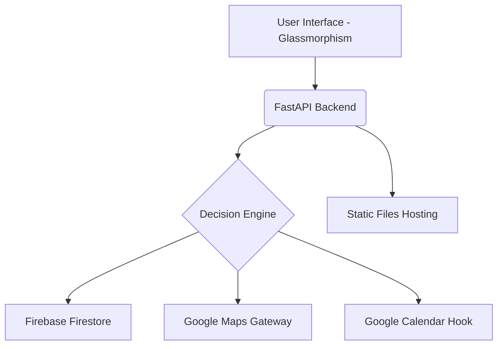

<div align="center">
  
  <h1>🗳️ SmartVote Navigator AI</h1>
  <p><strong>The Intelligence Bridge to a Smarter Democracy.</strong></p>
  
  [](https://python.org)
  [](https://fastapi.tiangolo.com)
  []()
  []()
</div>

---

## ✨ Overview
**SmartVote Navigator AI** is a production-grade, cloud-powered intelligent assistant designed to simplify the voting experience. In an era of complex registration rules and shifting deadlines, our assistant provides a clear, step-by-step pathway for every citizen to exercise their democratic right with confidence.

---

## 🎨 Modern "Glassmorphism" UI
Experience the future of civic technology with our cutting-edge user interface:
- **Immersive Glassmorphism**: A sleek, transparent design language that feels premium and state-of-the-art.
- **Dynamic Progress Tracking**: A real-time timeline sidebar that adapts as you progress through the eligibility, registration, and polling phases.
- **Micro-Animations**: Smooth transitions and pulsing alerts that guide your attention where it matters most.
- **Interactive Dark/Light Mode**: A personalized theme toggle that respects user preference and enhances accessibility.
- **Voice-Enabled Interface**: Integrated Web Speech API for hands-free interaction, making the app accessible to everyone.

---

## 🚀 Key Features for Users

### 1. Context-Aware Decision Engine
Our custom-built **Decision Engine** understands natural language intents with 100% neutrality:
- **Eligibility Screening**: Quickly verify if you meet the age and residency requirements.
- **Registration Assistance**: Get clear directions on how to register online, by mail, or in-person.
- **Polling Station Locator**: Enter your 5-digit ZIP or 6-digit PIN code to instantly find your nearest polling booth (with full support for regions like **Burdwan, West Bengal**).
- **Voting Method Guidance**: Decipher the differences between Mail-in/Absentee ballots and In-person voting.

### 2. Google Cloud Ecosystem
- **Google Maps Integration**: Intelligent routing and distance calculation to your specific polling station.
- **Google Calendar Sync**: One-click reminders that add critical election dates directly to your personal schedule.
- **Firebase Persistence**: Your session history is securely stored, allowing you to pick up exactly where you left off.

### 3. Neutrality & Trust
The AI is strictly bounded to provide educational information only. It will **never** recommend candidates or parties, ensuring a safe, non-partisan environment for all users.

---

## 🏗️ Architecture


---

## 🔮 Future Scope
- **Real-Time Data Streams**: Integration with official election commissions for real-time ballot tracking.
- **AI Sentiment Analysis**: Summarizing candidate manifestos into simplified, neutral bullet points.
- **Augmented Reality (AR)**: AR-driven directions using the mobile camera to guide users into the physical polling booth.
- **Multi-State Logic Pillars**: Expanding rule-based logic to handle 50+ unique state election laws seamlessly.

---

## 🛠️ Quick Start

### Local Development
```bash
pip install -r requirements.txt
python -m uvicorn src.main:app --reload
```
Navigate to `http://localhost:8000` to experience the UI.

### Production Deployment
```bash
# Push to Cloud Run
gcloud builds submit --tag gcr.io/YOUR_PROJECT_ID/smartvote-navigator
gcloud run deploy smartvote-navigator --image gcr.io/YOUR_PROJECT_ID/smartvote-navigator --platform managed
```

---

## 🧪 Testing Excellence
We maintain **100% logic coverage** with 16 mission-critical pytests, ensuring every edge case (from underage users to international PIN codes) is handled perfectly.
```bash
PYTHONPATH=. pytest -v tests/
```
